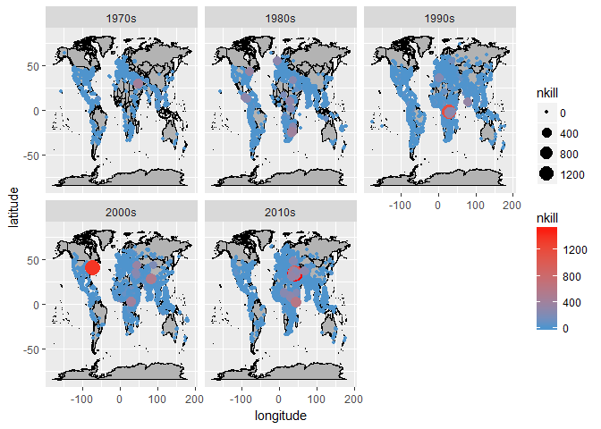
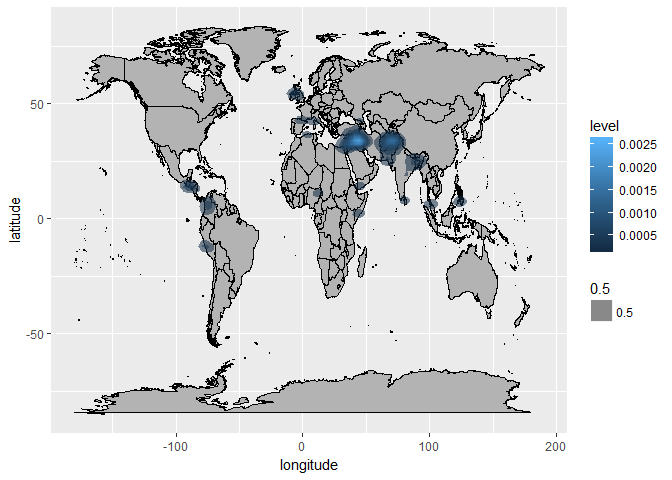

Global Terrorism Visualization
================
Bryce Curtsinger
December 11, 2018

R Markdown
----------

In this exercise, we will plot geospatial data in R using ggplot2 and ggmap. The data is a list of terrorist attacks worldwide since the 1970s. For obvious reasons, this post will be less personal than my other two blog posts, but the data provides a large number of observations and several dimensions we can consider to get a wide variety of plots. This post will highlight several features of ggplot2 that are useful in any plotting situation, as well as mapping-specific features. Familiarity with basic ggplot functions and structure is recommended to gain the most knowledge from this post.

Below I provide the data source & a brief description of packages used in this analysis.

Data source: <https://www.kaggle.com/START-UMD/gtd>

pacman - easy installation / loading of packages

tidyverse - data manipulation toolkit

ggplot2 - plotting toolkit

ggmap - mapping toolkit that integrates with ggplot2

    ## Warning in rbind(names(probs), probs_f): number of columns of result is not
    ## a multiple of vector length (arg 1)

    ## Warning: 272 parsing failures.
    ## row # A tibble: 5 x 5 col     row col       expected               actual file      expected   <int> <chr>     <chr>                  <chr>  <chr>     actual 1  7201 nhours    no trailing characters .25    'gtd.csv' file 2  9227 nhours    no trailing characters .25    'gtd.csv' row 3 10257 nhours    no trailing characters .25    'gtd.csv' col 4 10789 nhours    no trailing characters .25    'gtd.csv' expected 5 11927 propvalue no trailing characters .78    'gtd.csv'
    ## ... ................. ... ......................................................... ........ ......................................................... ...... ......................................................... .... ......................................................... ... ......................................................... ... ......................................................... ........ .........................................................
    ## See problems(...) for more details.

    ##     eventid              iyear          imonth            iday      
    ##  Min.   :1.970e+11   Min.   :1970   Min.   : 0.000   Min.   : 0.00  
    ##  1st Qu.:1.992e+11   1st Qu.:1992   1st Qu.: 4.000   1st Qu.: 8.00  
    ##  Median :2.009e+11   Median :2009   Median : 6.000   Median :15.00  
    ##  Mean   :2.003e+11   Mean   :2003   Mean   : 6.479   Mean   :15.53  
    ##  3rd Qu.:2.014e+11   3rd Qu.:2014   3rd Qu.: 9.000   3rd Qu.:23.00  
    ##  Max.   :2.017e+11   Max.   :2017   Max.   :12.000   Max.   :31.00  
    ##                                                                     
    ##  country_txt         region_txt         provstate        
    ##  Length:167354      Length:167354      Length:167354     
    ##  Class :character   Class :character   Class :character  
    ##  Mode  :character   Mode  :character   Mode  :character  
    ##                                                          
    ##                                                          
    ##                                                          
    ##                                                          
    ##      city              latitude        longitude       attacktype1_txt   
    ##  Length:167354      Min.   :-53.15   Min.   :-176.18   Length:167354     
    ##  Class :character   1st Qu.: 11.84   1st Qu.:   7.68   Class :character  
    ##  Mode  :character   Median : 31.60   Median :  43.66   Mode  :character  
    ##                     Mean   : 23.89   Mean   :  29.86                     
    ##                     3rd Qu.: 34.74   3rd Qu.:  69.15                     
    ##                     Max.   : 74.63   Max.   : 179.37                     
    ##                                                                          
    ##  targtype1_txt         gname           weaptype1_txt     
    ##  Length:167354      Length:167354      Length:167354     
    ##  Class :character   Class :character   Class :character  
    ##  Mode  :character   Mode  :character   Mode  :character  
    ##                                                          
    ##                                                          
    ##                                                          
    ##                                                          
    ##      nkill             nkillus       
    ##  Min.   :   0.000   Min.   :   0.00  
    ##  1st Qu.:   0.000   1st Qu.:   0.00  
    ##  Median :   0.000   Median :   0.00  
    ##  Mean   :   2.362   Mean   :   0.05  
    ##  3rd Qu.:   2.000   3rd Qu.:   0.00  
    ##  Max.   :1570.000   Max.   :1360.00  
    ##                     NA's   :55282

Visualizing Terrorism
---------------------

To begin, let's consider attacks split by decade. We will plot each incident separately, with color and size decided by the deadliness (measured as number of fatalities). we can initialize a world map using the "borders" function in ggmap, specifying 'world' as the database. Border and fill colors can be customized as well, but let's stick with a simple gray background with black borders. We can even save this base plot to an object, so we don't have to specify it each time we want to create a new map.

In each plot, we can use tidyverse grammar to filter our data by decade in the ggplot functions. We will add points for each incident with geom\_point, then add a color gradient to our points with scale\_color\_gradient, ranging from a light blue to red for low to high deadliness.

``` r
#Set up world map:
mapWorld <- borders("world", colour="black", fill="gray70")
```

    ## 
    ## Attaching package: 'maps'

    ## The following object is masked from 'package:purrr':
    ## 
    ##     map

``` r
wm <- ggplot(gtd, aes(x = longitude, y = latitude)) + mapWorld

#Plot by Decade

#70s
wm + geom_point(aes(x = longitude, y = latitude, color = nkill, size = nkill), data = gtd %>% filter(iyear >= 1970 & iyear <= 1980 & nkill <= 200)) + 
  geom_point(aes(x = longitude, y = latitude, color = nkill, size = nkill), data = gtd %>% filter(iyear >= 1970 & iyear <= 1980 & nkill > 200)) + 
  scale_color_gradient(low = "steelblue3", high = 'red', na.value = "grey50", guide = "colourbar" )
```


``` r
#80s
wm + geom_point(aes(x = longitude, y = latitude, color = nkill, size = nkill), data = gtd %>% filter(iyear >= 1980 & iyear <= 1990 & nkill <= 200)) + 
  geom_point(aes(x = longitude, y = latitude, color = nkill, size = nkill), data = gtd %>% filter(iyear >= 1980 & iyear <= 1990 & nkill > 200)) + 
  scale_color_gradient(low = "steelblue3", high = 'red', na.value = "grey50", guide = "colourbar" )
```


``` r
#90s
wm + geom_point(aes(x = longitude, y = latitude, color = nkill, size = nkill), data = gtd %>% filter(iyear >= 1990 & iyear <= 2000 & nkill <= 200)) + 
  geom_point(aes(x = longitude, y = latitude, color = nkill, size = nkill), data = gtd %>% filter(iyear >= 1990 & iyear <= 2000 & nkill > 200)) + 
  scale_color_gradient(low = "steelblue3", high = 'red', na.value = "grey50", guide = "colourbar" )
```


``` r
#2000s
wm + geom_point(aes(x = longitude, y = latitude, color = nkill, size = nkill), data = gtd %>% filter(iyear >= 2000 & iyear <= 2010 & nkill <= 200)) + 
  geom_point(aes(x = longitude, y = latitude, color = nkill, size = nkill), data = gtd %>% filter(iyear >= 2000 & iyear <= 2010 & nkill > 200)) + 
  scale_color_gradient(low = "steelblue3", high = 'red', na.value = "grey50", guide = "colourbar" )
```


``` r
#2010s
wm + geom_point(aes(x = longitude, y = latitude, color = nkill, size = nkill), data = gtd %>% filter(iyear >= 2010 & iyear <= 2020 & nkill <= 200)) + 
  geom_point(aes(x = longitude, y = latitude, color = nkill, size = nkill), data = gtd %>% filter(iyear >= 2010 & iyear <= 2020 & nkill > 200)) + 
  scale_color_gradient(low = "steelblue3", high = 'red', na.value = "grey50", guide = "colourbar" )
```


Facets
------

An alternative approach to 5 separate graphs is to use facets included in ggplot. Below we will reproduce these plots using a facet. First, a variable indicating the decade should be created, then used as the argument in the facet\_wrap function.

``` r
gtd <- gtd %>% mutate(decade = ifelse(iyear < 1980, '1970s', ifelse(iyear < 1990, '1980s', ifelse(iyear < 2000, '1990s', ifelse(iyear < 2010, '2000s', '2010s')))))

wm + geom_point(aes(x = longitude, y = latitude, color = nkill, size = nkill), data = gtd %>% filter(nkill <= 200)) + 
  geom_point(aes(x = longitude, y = latitude, color = nkill, size = nkill), data = gtd %>% filter(nkill > 200)) + 
  scale_color_gradient(low = "steelblue3", high = 'red', na.value = "grey50", guide = "colourbar" ) + 
  facet_wrap(~decade)
```



We see the same plots produced above in a nicely arranged grid. Additionally, this approach will standardized the size and color scales on all plots to make comparing across decades much simpler. We can see the spread of incidents and the magnitude of deadliness change over time.

Let's consider another use of the facet\_wrap function, this time considering attack type instead of decade.

``` r
wm + geom_point(aes(x = longitude, y = latitude, color = nkill, size = nkill), data = gtd %>% filter(nkill <= 200)) + 
  geom_point(aes(x = longitude, y = latitude, color = nkill, size = nkill), data = gtd %>% filter(nkill > 200)) + 
  scale_color_gradient(low = "steelblue3", high = 'red', na.value = "grey50", guide = "colourbar" ) + 
  facet_wrap(~attacktype1_txt)
```


Facets in ggplot make comparing across categorical measures quick and easy. As you can see with the plot above, the plots can become hard to read when wrapping across categorical variables with a lot of levels.

Specialized Visualizations
--------------------------

In the plots above, it can be difficult to identify how many incidents occur in an area due to overlapping points and the sheer number of datapoints. One way to effectively visualize the density of points on a plot is with a heatmap. Below, we will use the "stat\_density2d" function in ggplot to generate a heatmap. Note the argument to the 'fill' command "..level.." will automatically scale the color based on the density at that location, and 'alpha' = 0.5 decides how see-through our heatmap is.

``` r
wm  + stat_density2d(data=gtd, aes(x=longitude, y=latitude, fill=..level.., alpha = 0.5), geom="polygon")
```



We can even combine our heatplot maps with the facet\_wrap function we used above. This provides a great visualization of how terrorism "hotspots" changed over time.

``` r
wm  + stat_density2d(data=gtd, aes(x=longitude, y=latitude, fill=..level.., alpha = 0.5), geom="polygon") + facet_wrap(~decade)
```


Conclusions & Takeaways
-----------------------

Working with geospatial data can be overwhelming, but knowing the right graphing tools can make visualizing this data a breeze. To review, we learned how to adapt basic ggplot2 grammar to include geospatial data with latitudes and longitudes, used facets to easily compare graphs across other measures, and created specialized visualizations in the form of heat maps to show the density of points on a map. Many other tools are available to improve the quality of maps and plot locations at higher levels of granularity. Some functions even allow you to integrate with Google Maps (assuming you have an API key) to pull satellite graphs or gps-quality maps into R. However, understanding the basics of mapping in R is necessary to move to this level of detail.
